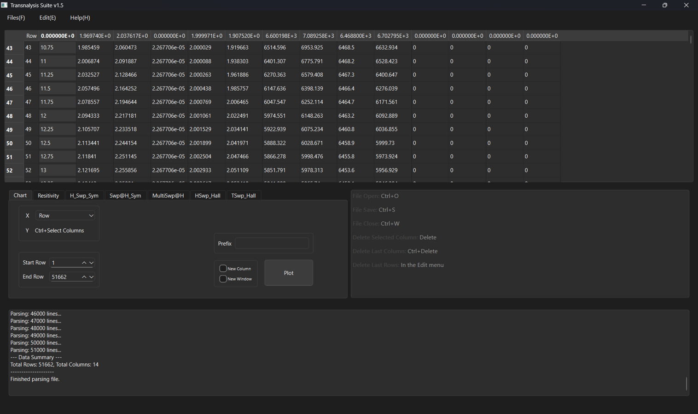
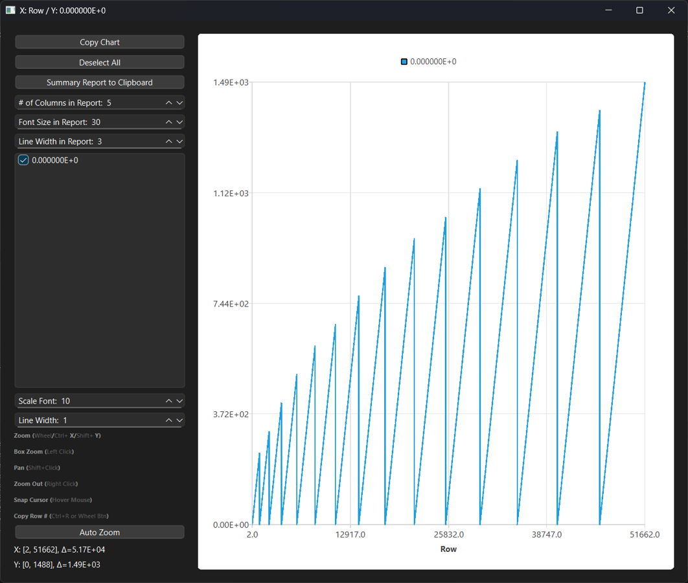
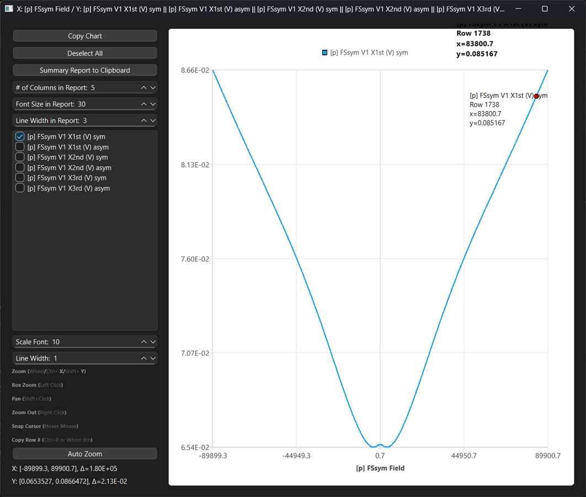

# Transnalysis

[](https://github.com/PaneledBus122/transnalysis/actions/workflows/build.yml)

A Qt6/C++ desktop application for interactive analysis of electrical transport
data — resistivity, Hall effect (mobility, carrier density), and
field-/temperature-sweep symmetrization — built for condensed matter transport
measurements.

It targets data of the kind produced by systems such as a Quantum Design
PPMS or MPMS. In the author's setup, custom electronics are interfaced with
a PPMS to acquire the raw voltage/field/temperature signals that
Transnalysis then loads and processes.



## What it does

Transnalysis loads raw transport-measurement data (large multi-column text
files, tens of thousands of rows) into an interactive table and lets you run
a set of transport-analysis routines on it, each as its own tab:

| Tab | Purpose |
|---|---|
| **Chart** | Plot any columns against each other with an interactive chart (zoom, pan, cursor readout, multi-series overlay, image report export) |
| **Resitivity** | ρ = (V / I) · (t · w / L), σ = 1 / ρ |
| **H_Swp_Sym** | Field-sweep symmetrization / anti-symmetrization |
| **Swp@H_Sym** | Temperature-sweep symmetrization, with a scan filter that discards unsettled points after each temperature step |
| **MultiSwp@H** | Extracts data at a set of target field values across multiple sweeps, with interpolation |
| **HSwp_Hall** | Single field-sweep Hall analysis: Hall coefficient, carrier density, mobility, carrier type |
| **TSwp_Hall** | Temperature-dependent Hall analysis: interpolates onto a common temperature grid and reports ρxx, ρxy, n, μ vs. T |

A typical workflow: load a data file (drag-and-drop or `File > Open`), pick the
X/Y columns for a raw sweep like the one below —



— then symmetrize it, which anti-symmetrizes/symmetrizes the positive and
negative sweep branches and produces the physical response, e.g.:



Results can be appended as new columns in the table, opened in a new window,
and exported to CSV/TSV/plain text along with an analysis log describing
exactly which formula, columns, and row range were used.

## Physics

All calculations use SI units internally (V, A, m) and report both SI and
common cm-based units in the log.

- **Resistivity / conductivity**: ρ = (V / I) · (t·w / L),  σ = 1 / ρ
- **Hall coefficient**: R_H = Δρ_xy / ΔB, from a linear fit of the
  anti-symmetrized transverse voltage vs. field
- **Carrier density**: n = 1 / (|R_H| · e)
- **Mobility**: μ = |R_H| / ρ_xx
- **Carrier type**: sign of R_H (positive → p-type / holes, negative →
  n-type / electrons)

## Building

**Requirements**
- CMake 3.16+
- Qt6 (or Qt5) with the **Widgets** and **Charts** components
- A C++17 compiler (MSVC, MinGW, GCC, or Clang)

```bash
git clone https://github.com/PaneledBus122/transnalysis.git
cd transnalysis
cmake -B build -S .
cmake --build build --config Release
```

The CMake script auto-detects Qt6 vs Qt5 and links against
`Qt::Widgets` and `Qt::Charts` only — there are no other external
dependencies.

## License

Apache License 2.0 — see [LICENSE](LICENSE).

## Author

Seongjoon Lim
